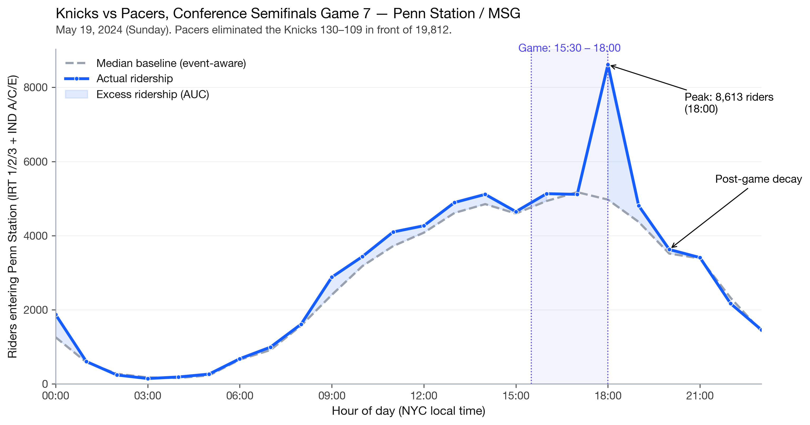

# NYC Subway Events from Ridership Data

> **I built a pipeline that reads NYC's 2024 event calendar - concerts, ball games, parades, the marathon, NYE - straight out of MTA subway ridership data, without ever opening an event schedule.**

*A comparative field guide to the signatures different events leave on the system. Built from 12 months of public ridership data, no event metadata required.*



---

## The thesis, in one paragraph

The MTA publishes hourly ridership at every station. Pick five station
archetypes - Penn Station / MSG, Atlantic Av-Barclays, Mets-Willets, Yankee
Stadium, Times Square - build an event-aware seasonal baseline of what
"normal" looks like at each, and the deviations from baseline let you
recover, by date and station, **virtually every major event that happened
in NYC in 2024** without ever opening a calendar. Then quantify each event
along five fingerprint dimensions (peak intensity, lead time, lag time,
decay half-life, asymmetry ratio) and ask which events leave which
signatures.

The result is a comparative field guide: a **Knicks Game 7 looks like
this. A World Series night game looks like that. A parade looks
nothing like either.**

---

## Key findings

- **The detector found the World Series before being told it existed.** The biggest single anomaly hour of 2024 at Yankee Stadium was `2024-10-29 23:00` at **+15,507 riders above the normal Tuesday baseline**. The pipeline flagged it cold, with no access to any sports schedule or event calendar. Cross-referencing to ground truth identified it as *Yankees vs Dodgers, World Series Game 4*. The same trick recovered NYE at Times Square, the Macy's Thanksgiving Day Parade, the NYC Marathon, every Mets playoff home game, every Knicks playoff home game, and the Rangers' run to the Eastern Conference Final.
- **The building shapes the fingerprint more than the sport.** Knicks games, Rangers games, and MSG concerts all share one k-means cluster - they're more similar to each other than any of them are to a Mets game next door at Citi Field. Within that cluster, Knicks events have measurably higher peaks than Rangers (p = 0.004) but inhabit the same archetype. This was the most surprising structural result in the data.
- **Yankees day vs night games are statistically distinct fingerprints.** Night-game peak intensity is 3× day-game (33.5 vs 11.8 × baseline). Day-game ridership dissipates into normal afternoon traffic; night games hit a 1 AM wall.
- **Parades are spectacularly asymmetric.** People arrive ~6 hours early for the route and leave fast. Every other event type is the reverse.
- **Across the full year, the system matched 495 of 513 known events** — 96.5% recall after the event-aware baseline refit, up from 477 (93.0%) with the naive baseline, and with no event metadata leaked into detection. Of the 18 remaining misses, all but one were at Penn Station / MSG, where multi-night residencies (Phish, Billy Joel) and high commuter baselines absorb part of the event signal.
- **An event-aware baseline refit closes a contamination gap.** Naively, the median baseline at MSG was already partially game-day-influenced (Knicks play >50% of winter Tuesday evenings). Excluding event-window hours from the baseline-input pool lifted recall on Knicks/Rangers/MSG-concert events by 5-16 percentage points each.

---

## The four charts

1. **[Hero baseline](figures/01_hero_baseline_msg_g7.png)** - Knicks Game 7 at MSG, baseline vs actual ridership, 24h.
2. **[Urban matrix heatmap](figures/02_urban_matrix.png)** - mean peak intensity by station × event type; cell labels carry sample size.
3. **[Cluster scatter](figures/03_cluster_scatter.png)** - peak intensity vs asymmetry ratio, colored by k=6 cluster, shape by event type; four exemplar events annotated.
4. **[Decay small multiples](figures/04_decay_small_multiples.png)** - post-event ridership decay for nine representative events with their fitted curves overlaid.

---

## How it works

```
ingest/         pull 2024 hourly ridership for 5 station archetypes
                from the MTA Socrata API. Validate, cache to Parquet,
                emit a data-quality report.

baseline/       compute hour-of-day × day-of-week median baselines per
                station, segmented Summer (Apr-Oct) vs Winter (Nov-Mar)
                and excluding federal holidays. Then refit a second
                time excluding known event windows, to remove the
                event-day contamination that depresses detection at
                venues like MSG where the team plays >50% of weeknights.

anomaly/        per hour, compute (actual − baseline)/baseline AND a
                28-day rolling z-score matched on hour-of-week. Flag
                with both methods, keep both columns for comparison.

ground_truth/   scrape MLB / NBA / NHL schedules from the
                sports-reference.com family, MSG/Barclays concerts from
                the setlist.fm API, plus hand-curated civic events,
                playoffs, and US Open sessions. Match each event to a
                ±3h window of flagged anomalies; join NOAA Central
                Park weather to explain false negatives.

fingerprint/    extract five features per matched event
                (peak / lead / lag / asymmetry / decay half-life),
                log-transform peak_intensity, standardize, cluster
                with k-means + Ward hierarchical, embed with UMAP for
                visualization only.

viz/            charlie2bored-styled matplotlib charts: the four
                deliverables above.
```

Methodology details and decision log live in
[docs/thought_process.md](docs/thought_process.md) - a
plain-language journal that a non-technical reader can follow.

---

## Reproducing the project

```bash
# Requires Python 3.11+, ~2 GB free disk, 20 minutes total runtime.
python -m venv .venv && source .venv/bin/activate
pip install -r requirements.txt

# Optional: drop a SETLIST_FM_API_KEY into .env for concert coverage.

# Pipeline - each stage stops on a report you can review.
python -m ingest.resolve_stations          # confirm station_complex_id mapping
python -m ingest.pull_2024                 # ~3 min: cache 2024 ridership
python -m ingest.data_quality              # data quality report

python -m baseline.build                   # naive seasonal baselines
python -m anomaly.build                    # naive anomalies
python -m ground_truth.build               # ~3 min: scrape events
python -m ground_truth.match               # naive matching report

python -m baseline.refit                   # event-aware baselines (v2)
python -m anomaly.build --suffix _v2
python -m ground_truth.match --suffix _v2  # v2 matching: 96.5% recall

python -m fingerprint.extract              # 5 features per event
python -m fingerprint.cluster              # k-means + hierarchical + UMAP

python -m viz.build_all                    # render the four charts
```

Every stage writes a Markdown report into `data/processed/` and (where
applicable) figures into `figures/` as both PNG (300 DPI) and SVG.
Re-runs are idempotent: HTML / API responses are cached to disk on first
fetch, so repeated runs don't re-hit external services.

---

## Repo layout

```
ingest/         Socrata client, station resolver, 2024 puller, DQ checks
baseline/       Hour-of-week median baselines (seasonal, holiday-aware,
                with event-aware refit)
anomaly/        Ratio + rolling-z anomaly detection
ground_truth/   Event scraping (MLB / NBA / NHL / concerts) + hand-
                curated civic & US Open + matcher + NOAA weather
fingerprint/    Feature extraction + clustering
viz/            Style sheet + four portfolio charts
data/raw/       Cached external pulls (gitignored)
data/processed/ Cleaned dataframes + Markdown reports (checked-in)
figures/        Portfolio chart PNG/SVG outputs
docs/           Thought-process journal, sourcing plan, data notes
```

---

## Honest limits

- **One year (2024) only.** Calendar-year scope was deliberate but
  means seasonal effects can't be cross-validated.
- **Citi Field stadium concerts are missing from ground truth.**
  setlist.fm has a Citi Field venue page but our scraper only walks
  MSG and Barclays. After matching, 3,812 flagged anomaly hours
  across all stations remain unexplained by our ground-truth event
  set (see `data/processed/matching_report.md`); the top of that
  list is dominated by Mets-Willets summer nights, which is exactly
  what missing Citi Field concerts would look like.
- **Penn Station has two complexes** (1/2/3 vs A/C/E). The msg_penn
  archetype aggregates both at the anomaly layer; baselines are
  computed per-complex so the structural difference is preserved.
- **Phish residencies still slip past.** When an artist plays MSG a
  dozen nights in a year, even the event-aware baseline absorbs
  some of their pattern. A second iteration of the refit would help.

---

*Built by Charlie Vargas. See [charlie2bored.com](https://charlie2bored.com).*
